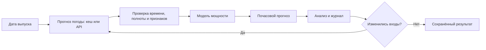

# Памятка команды: Wind Agent простыми словами

## Что мы делаем и кому это нужно

Мы прогнозируем **мощность двух ветротурбин для каждого часа на следующие 24–48 часов**. Интерфейс ориентирован на инженера, планирующего работу ВЭС: посмотреть ожидаемую мощность, сравнить турбины и проверить, на каких погодных данных основан результат. Это выбранный нами пользовательский сценарий; коммерческие показатели в условии не заданы.

В кейсе нужно «перенестись в прошлое»: например, 31 января сформировать прогноз на 1–2 февраля, затем повторять выпуск каждый день. Нельзя использовать погоду, которая стала известна только после момента прогноза.

У нас уже подключены реальные исходные CSV, погодный кеш и CatBoost из проекта команды. Телеметрия заканчивается **31 января 2026 в 23:50**. Фактов февраля нет, поэтому точность за февраль пока не измеряется.

## Как открыть готовый показ

Откройте терминал **в корне репозитория**, где лежит README:

```powershell
python -B -m windagent doctor
python -B -m windagent serve
```

Перейдите на **http://127.0.0.1:8080**. Если наш сервер уже работает, второй запуск не нужен. Для остановки — `Ctrl+C`.

`doctor` показывает папку данных и доступность CatBoost. `can_recompute_project=true` означает, что среда готова к новому прогнозу; сама эта проверка не запускает модель. Сохранённое состояние загружается автоматически. **Не импортируйте архив заново перед каждым показом.** Для пустой папки данных есть отдельная [инструкция первого импорта](../README.md#импортировать-проект-впервые).

## Три разных действия

| Действие | Что происходит | Что можно сказать |
|---|---|---|
| Открыть готовый показ | Читаются сохранённые данные и результаты | «Показываем результат выбранного выпуска» |
| Получить новый прогноз | Уже обученная CatBoost получает погодные признаки и вычисляет мощность | «Модель выполнена заново», если указан `execution=recomputed` |
| Независимо повторить обучение | Модель заново обучается на разрешённой истории; затем повторяется отдельная оценка | Только после завершения и проверки этого процесса можно говорить о воспроизведении обучения |

Если указан `saved_archive`, показаны готовые значения из архива, а модель в этом запросе не запускалась. Если `reused=true`, возвращён ранее сохранённый результат с теми же входами.

**Уже подтверждён один новый native-запуск:** 96 значений, две турбины × 48 часов, максимальное отличие от сохранённого прогноза — `0`. Это не подтверждение всех 29 запусков или независимого обучения. Актуальные результаты проверок записываются в [VERIFICATION.md](VERIFICATION.md).

Для отдельного повторного обучения есть [scripts/retrain_project.py](../scripts/retrain_project.py); он создаёт новый эксперимент и не заменяет активное состояние панели. Это следующий самостоятельный этап, а не команда перед каждым выступлением. Установка среды и запуск описаны в [README](../README.md#независимое-повторное-обучение).

## Цикл агента



Агент управляет последовательностью действий и проверками. В режиме `project` он работает с **локальным погодным кешем**; кнопка «Проверить кеш проекта» не скачивает новые прогнозы. В отдельном режиме `archive` есть обращение к погодному API. Синтетический `demo` нужен для учебной проверки.

Проверки времени используют имеющиеся метаданные. Для архива пока принято, что погода доступна через 8 часов после запуска модели. Это предположение, а не доказанная дата публикации.

## Пять терминов

| Термин | Простое объяснение |
|---|---|
| **AI-агент** | Управляющий код, который сам проходит цикл, проверяет условия и решает, нужен ли повторный расчёт. Здесь ему не требуется чат или LLM |
| **CatBoost** | ML-модель: после обучения на примерах она преобразует погодные признаки в ожидаемую мощность |
| **Горизонт** | Насколько далеко вперёд делается прогноз: 24 или 48 часов после момента выпуска |
| **Нормализованная мощность** | Мощность в принятой шкале 0–1: значение 0,5 отображается как 50%. Это ещё не МВт и не энергия в МВт·ч |
| **MAE** | Средняя абсолютная ошибка. MAE 0,186 соответствует примерно 18,6 процентного пункта мощности; это не «точность 81,4%» |

В отчёте также есть RMSE: эта ошибка сильнее штрафует большие промахи. Наши январские MAE/RMSE около **18,60/25,72 п. п.** арифметически перепроверены по 2928 сохранённым прогнозам CatBoost. Это январская проверка, не февральский результат и не независимое повторное обучение.

## Что обязательно по кейсу

Источник — [CASE.md](CASE.md) и переданное условие, без дополнительных предположений о баллах жюри.

- Обучение на предоставленной истории ВЭС до конца января 2026.
- Автоматическое получение внешних погодных прогнозов по координатам.
- Почасовой прогноз на 24–48 часов.
- Последовательное воспроизведение выпусков начиная с 31 января на тестовый февраль.
- Для каждого выпуска — погодный прогноз, доступный **на тот момент**, а не фактическая погода, известная позднее.
- Полный цикл: получение погоды → подготовка данных → модель → почасовой результат → анализ → повторный расчёт при обновлении входов.

Методы обработки, ML-модель, архитектура агента и открытый источник погоды оставлены на выбор участников.

## Что является нашим выбором или дополнением

Веб-панель, график, журнал, CSV-экспорт и `doctor` помогают показать и проверить решение. В переданном условии не заданы обязательный дизайн, облачный хостинг, Docker, Telegram-бот, конкретная библиотека или обязательная LLM.

Формат submission и формула конкурсной метрики ещё требуют уточнения. Мы не придумываем веса критериев и не обещаем заданный уровень точности. Номинальные мощности нужны для физических МВт/МВт·ч; пока показываем нормализованную мощность.

Самые важные незакрытые вопросы: часовой пояс и смысл меток исходной телеметрии, оперативное происхождение ранней ECMWF-серии/hindcast, историческое время публикации погоды. Поэтому **готовность к конкурсу не заявляется**.

## Речь на 60–90 секунд

> Мы делаем Wind Agent — систему почасового прогноза мощности двух ветротурбин на 24–48 часов. Такой прогноз помогает человеку, планирующему работу станции, увидеть ожидаемую мощность и проверить её исходные данные.
>
> В проект подключена реальная телеметрия: 48 тысяч 452 полных турбино-часа. Модель CatBoost получает признаки погодного прогноза. Агент проверяет время и полноту данных, получает почасовые значения и сохраняет журнал с происхождением результата.
>
> На экране можно переключать турбины, смотреть график и выгружать CSV. Мы различаем новый запуск модели и сохранённый расчёт из архива. Один новый выпуск уже проверен: 96 значений полностью совпали с сохранённым результатом.
>
> Январская средняя абсолютная ошибка составляет около 18,6 процентного пункта; арифметика проверена по сохранённым прогнозам. Фактов февраля нет, поэтому точность за февраль мы не заявляем.
>
> Главные ограничения открыты: нужно подтвердить часовой пояс телеметрии и доказать, когда исторические погодные прогнозы были опубликованы. Полное соответствие этим требованиям пока не подтверждено.

Если открытый результат имеет `saved_archive`, добавьте: «Сейчас на экране сохранённый расчёт; модель в этом запросе не запускалась».

## Чек-лист перед ручным показом

- [ ] `doctor` видит нужное рабочее пространство; сервер открывается на 8080.
- [ ] В панели выбраны реальные данные проекта, источник «Кеш проекта · ECMWF» и UTC.
- [ ] Дата **показанного результата**, а не только значение формы, соответствует нужному выпуску; понятен его статус `recomputed` / `saved_archive`.
- [ ] Переключение турбин меняет график и таблицу; «Среднее двух турбин» не подписано как МВт·ч.
- [ ] Выбор 24 часов понятен как настройка следующего запроса: сохранённый 48-часовой график до запроса остаётся прежним.
- [ ] В журнале и источниках видны ограничения доступности погоды; сохранённый результат не выдан за новый.
- [ ] CSV скачивается; для отдельного 48-часового выпуска ожидаются 96 строк данных обеих турбин.
- [ ] Январские ошибки подписаны как январские; февральская точность не показана без фактов.
- [ ] В узком окне доступны меню и кнопки, а таблицы можно прокручивать.

Браузерное управление в текущем сеансе недоступно: **этот чек-лист требует ручного прохождения**. Проверки API и функций JavaScript не заменяют просмотр экрана. Полный сценарий с ожидаемыми числами — [DEMO.md](DEMO.md#ручная-проверка-панели-перед-показом).

Новый прогноз и независимое обучение выполняйте как отдельные задачи. Не запускайте изменяющие данные CLI-команды параллельно с сервером в том же рабочем пространстве. `.env.example` — только справка: приложение не читает её автоматически; переменную среды задают в терминале перед запуском.
